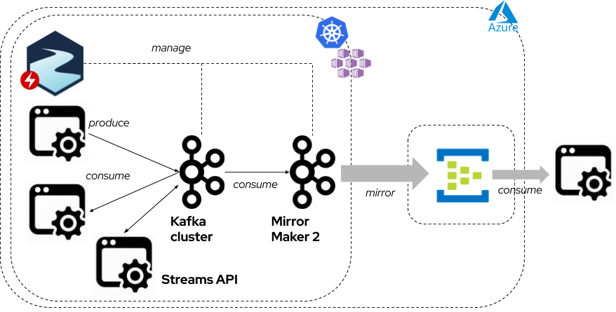

# devday-2020-strimzi-aks-eventhub

Demo session at DevDay 2020 "Strimzi: running your Apache Kafka cluster on Kubernetes"

Slides deck is available [here](https://www2.slideshare.net/paolopat/strimzi-running-your-apache-kafka-cluster-on-kubernetes)

## Modules

* 00 - [Deploy Azure Kubernetes Service](00-deploy-aks.md)
* 00 - [Deploy Azure Event Hubs](00-deploy-eh.md)
* 01 - [Prerequisites](01-prerequisites.md)
* 02 - [Deploy Strimzi](02-deploy-strimzi.md)
* 03 - [Deploy Apache Kafka](03-deploy-kafka.md)
* 04 - [Topic creation](04-topics-creation.md)
* 05 - [Deploy Internal Applications](05-deploy-internal-applications.md)
* 06 - [Deploy Kafka Mirror Maker 2](06-deploy-mm2.md)
* 07 - [Deploy applications](07-deploy-streams-eh-applications.md)